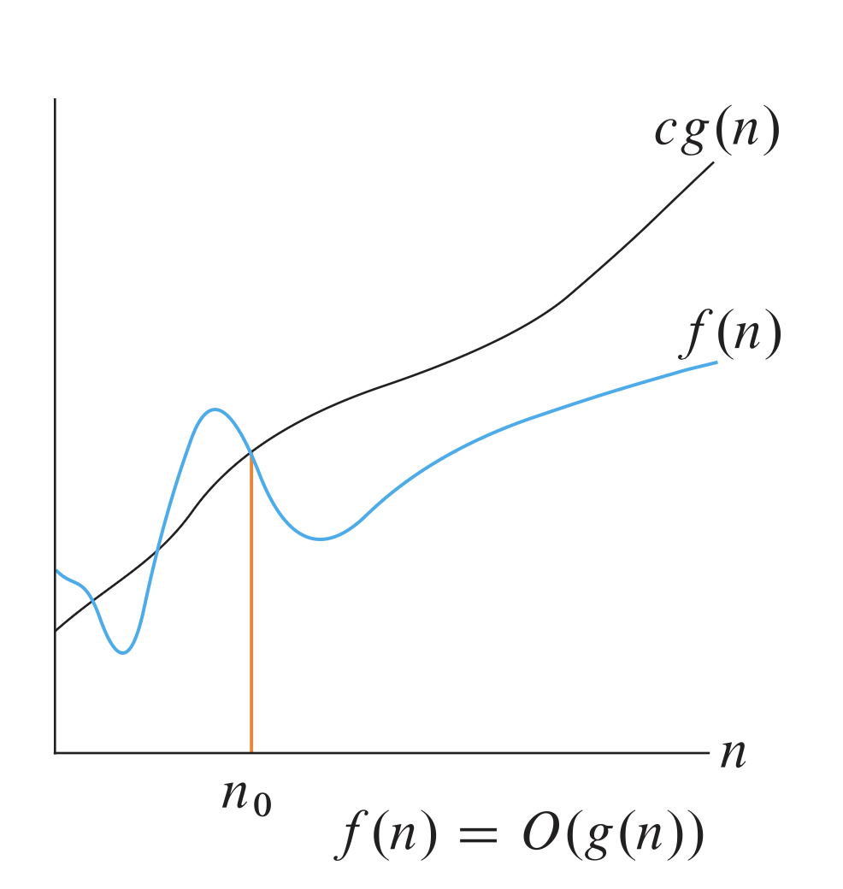
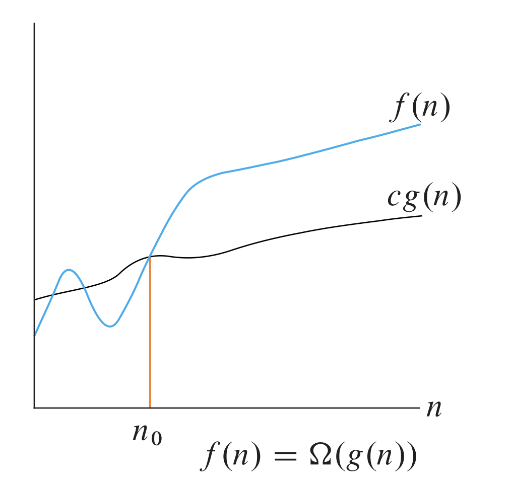
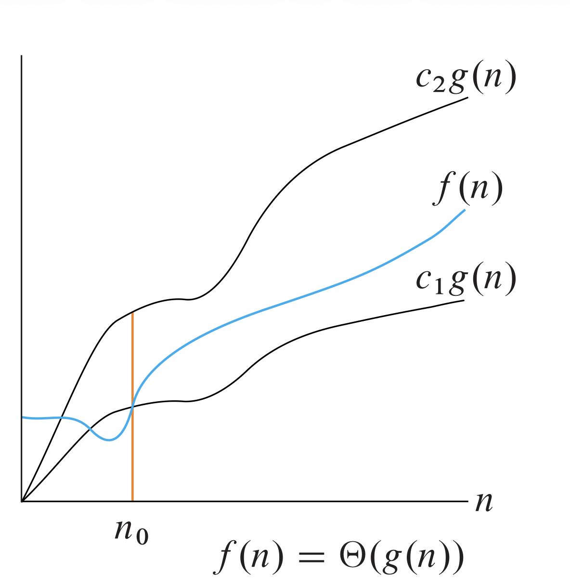

# Running Times

## Notations

### $O$-notation

```math
\begin{aligned}
O(g(n)) = \{f(n)&: \text{there exist positive constants } c \text{ and } n_0 \text{ such that} \\
& 0 \le f(n) \le c g(n) \text{ for all } n \ge n_0\}
\end{aligned}
```

$g(n)$ is an **asymptotic upper bound** for $f(n)$.



### $\Omega$-notation

```math
\begin{align*}\Omega(g(n)) = \{f(n)&: \text{there exist positive constants } c \text{ and } n_0 \text{ such that }\\  
&0 \le c\cdot g(n) \le f(n) \text{ for all } n \ge n_0\}\end{align*}
```

$g(n)$ is an **asymptotic lower bound** for $f(n)$.



### $\Theta$-notation

```math
\begin{align*}\Theta(g(n)) = \{f(n)&: \text{there exist positive constants } c_1, c_2, n_0 \text{ such that }\\  
&c_1\cdot g(n) \le f(n) \le c_2\cdot g(n) \text{ for all } n \ge n_0\}\end{align*}
```

$g(n)$ is an **asymptotic tight bound** for $f(n)$.



## Some examples

:bulb:**Prove that $f(n) = 5n^2 - 2n + 10$ is $O(n^2)$**.

Set up the inequality:

$$5n^2 - 2n + 10 \le c \cdot n^2$$

To find $c$, we can ignore the negative terms and overestimate the constants:

$$5n^2 - 2n + 10 \le 5n^2 + 10$$

For $n \ge 1$, we know $10 \le 10n^2$, so:

$$5n^2 + 10 \le 5n^2 + 10n^2 = 15n^2$$

By choosing $c = 15$ and $n_0 = 1$, the inequality $5n^2 - 2n + 10 \le 15n^2$ is satisfied. Thus, $5n^2 - 2n + 10 = O(n^2)$.


:bulb:**Prove $2n^3 - 5n^2 = \Omega(n^3)$**.

Find $c > 0$ and $n_0 > 0$ such that $$2n^3 - 5n^2 \geq c \cdot n^3$$

We want to subtract a term from $2n^3$ but still keep it proportional to $n^3$.

If $n \geq 5$, then $5n^2 \leq n^3$.

Substituting this into our function: $$2n^3 - 5n^2 \geq 2n^3 - n^3 = n^3$$

By picking $c = 1$ and $n_0 = 5$, the inequality $2n^3 - 5n^2 \geq 1 \cdot n^3$ holds for all $n \geq 5$.


:bulb: **Prove $4n^2 + n \lg n = \Theta(n^2)$**
- Prove $O(n^2)$ (Upper Bound):
$$4n^2 + n \lg n \le 4n^2 + n^2 = 5n^2$$ (for $n \ge 1$ because $\lg n \le n$). So, $c_2 = 5$.

- Prove $\Omega(n^2)$ (Lower Bound):
$$4n^2 + n \lg n \ge 4n^2$$ (for $n \ge 1$ since $n \lg n$ is positive). So, $c_1 = 4$.

Therefore, With $c_1 = 4$, $c_2 = 5$, and $n_0 = 1$, the function is bounded tightly. Thus, $4n^2 + n \lg n = \Theta(n^2)$.
### Comparing functions
Asymptotic notations behave similarly to inequality operators ($<, \le, =, \ge, >$).

|Property | Description |
| :---: | --- |
| **Transitivity**| If $f(n)=O(g(n))$ and $g(n)=O(h(n))$, then $f(n)=O(h(n))$. (Also applies to $\Omega$ and $\Theta$). |
| **Reflexivity** | $f(n)=O(f(n))$, $f(n)=\Omega(f(n))$, and $f(n)=\Theta(f(n))$. |
| **Symmetry** | $f(n)=\Theta(g(n))$ if and only if $g(n)=\Theta(f(n))$.|
| **Transpose Symmetry** | $f(n)=O(g(n))$ if and only if $g(n)=\Omega(f(n))$| .

### Usefull math properties

**Stirling's approximation**:

$$n! = \sqrt{2\pi n} \left(\dfrac{n}{e}\right)^n \left(1 + \Theta \left(\dfrac{1}{n}\right) \right)$$

$$\Rightarrow \log (n!) = \Theta(n\log n)$$

**Fibonacci numbers**:
We define Fibonacci numbers $F_i$ for $i \ge 0$ as follow:

```math
F_i = 
\begin{cases}
& 0  &\text{if } i = 0\\
& 1  &\text{if } i = 1 \\
& F_{i-1} + F_{i-2} &\text{if } i \ge 2 \\
\end{cases}
```

We have the **Bitnet formula**:

$$F_i = \dfrac{\phi^i - \psi^i}{\sqrt{5}}$$

with $\phi=\dfrac{1+\sqrt{5}}{2}$ being the **golden ratio** and $\ \psi=\dfrac{1-\sqrt{5}}{2}$ being $\phi$'s conjugate.

Since $|\psi^i| < 1$, we have 

$$\dfrac{|\psi^i|}{\sqrt{5}} <  \dfrac{1}{\sqrt{5}} < \dfrac{1}{2}$$

$$\Rightarrow F_i = \left \lfloor \dfrac{\phi^i}{\sqrt{5}} \right \rceil$$

Therefore, Fibonacci numbers grow **exponentially**.

**Common Order**
$$\log < \text{Poly} < \text{Expo} < \text{Factorial} < \text{Super Expo}$$
OR
$$\log n < n^k < a^n < n! < n^n < 2^{2^n}$$

# Recurrence
## Substitution Method

> [!NOTE]
> **PROCESS**
> 1. Guess the solution
> 2. Use **induction** to find the constants and show that the solution works.

However, when using induction, it is not necessary to show base case in our proof because for any constant $n$, $T(n)$ is always constant, and it is always possible to choose base cases that work.

**Example**:
We have $T(n) = 2T(n/2) + \Theta(n)$.

1. **Upper Bound**:
We rewrite $T(n) \le 2T(n/2) + cn$ for some positive constant $c$.

**Guess**: $T(n) \le dn\lg n$ for some positive constant $d$. We are given $c$ in the recurrence, and we want to choose $d$ as any positive constant.

**Substitution**:

```math
\begin{align*}
T(n) &\le 2T(n/2) + cn \\ 
&= 2\left(d\dfrac{n}{2} \lg \dfrac{n}{2}\right) + cn \\
&= dn \lg \dfrac{n}{2} + cn \\
&= dn \lg n - dn + cn \\
&\le dn\lg n
\end{align*}
```

if $-dn + cn \le 0 \Rightarrow d \ge c$.
Therefore, $T(n) = O(n \lg n)$

2. **Lower Bound**: 
We rewrite $T(n) \ge 2T(n/2) + cn$ for some positive constant $c$.

**Guess**: $T(n) \ge dn\lg n$ for some positive constant $d$.

**Substitution**:

```math
\begin{align*}
T(n) &\le 2T(n/2) + cn \\ 
&= 2\left(d\dfrac{n}{2} \lg \dfrac{n}{2}\right) + cn \\
&= dn \lg \dfrac{n}{2} + cn \\
&= dn \lg n - dn + cn \\
&\ge dn\lg n
\end{align*}
```

if $-dn + cn \ge 0 \Rightarrow d \le c$.
Therefore, $T(n) = \Omega(n \lg n)$

Therefore, $T(n) = \Theta(n \lg n)$

> [!NOTE]
We can use **recursion tree** to generate initial guess, and then prove using substitution.

## Master Method
Used for many Divide-and-Conquer Recurrence with the form 

$$T(n) = aT(n/b) + f(n)$$ 

where $a \ge 1, b > 1$ and $f(n) > 0$.

The method is based on the **master theorem**.

Compare $n^{\log_ba}$ .vs $f(n)$:

**Case 1**: $f(n) = O(n^{\log_ba-\epsilon})$ for some constant $\epsilon > 0$.

($f(n)$ is polynomially smaller than $n^{\log_ba}$).

**Solution:** 

$$T(n) = \Theta(n^{\log_ba})$$

Intuitively: Cost dominated by **leaves**.

**Case 2**: $f(n) = \Theta(n^{\log_ba} \cdot \lg^kn)$, where $k \ge 0$.

($f(n)$ is within polylog factor of $n^{\log_ba}$ but not smaller).

**Solution**: 

$$T(n) = \Theta(n^{\log_ba}\cdot \lg^{k+1} n)$$

(Intuitively: cost is $n^{\log_ba}\cdot \lg^kn$ at each level, and there are $\lg n$ levels.)

Simple case: $k=0 \Rightarrow f (n)=n^{\log_b a} \Rightarrow T(n)=(n^{\log_ba} \lg n$).

**Case 3**: $f(n) = \Omega(n^{\log_ba+\epsilon})$ for some constant $\epsilon > 0$ and $f(n)$ satisfies the **regularity condition** $af(n/b) \le cf(n)$ for some constant $c < 1$ and all sufficiently large $n$.

($f(n)$ is polynomially greater than $n^{\log_ba}$).

**Solution**: 

$$T(n)=(f(n))$$

(Intuitively: cost is dominated by **root**).
