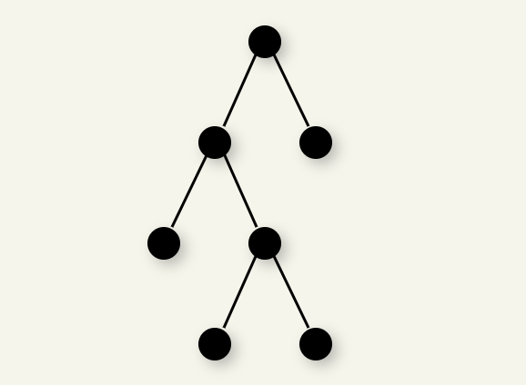
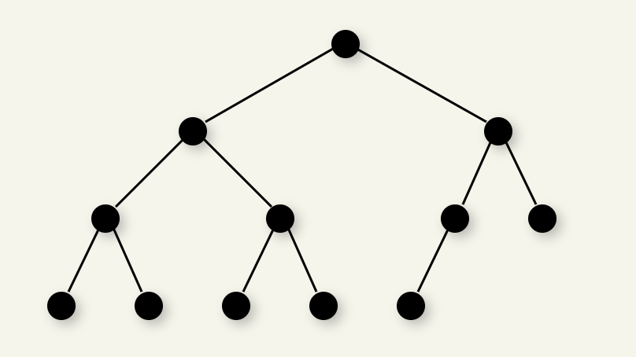
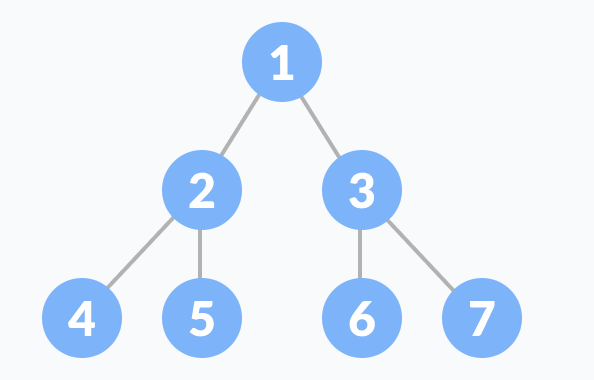

# BINARY TREES

## Some Definitions:
- **Internal node**: node having at least one child.
- **Depth/ Level** of a node: # edges from root->node.
    > D(root) = 0

- **Height** of node: # edges on the longest simple path from node -> leaf.
    - Height of tree is the height of root, and is equal to max depth of any node in the tree.


## Properties of BT:
> [!NOTE]
> 1. Max # nodes at level $l$ : $2^l$.
> 2. Max # nodes of BT of height $h$: $2^{h+1}-1$.
> 3. Min height for $N$ nodes: $\lfloor \log_2N \rfloor$.[^2]
> 4. Min levels for $L$ leaves: $\lfloor \log_2L \rfloor$
> 5. Total edges of BT with $n$ nodes: $n-1$ _(Because each node has 1 parent, except root)_.
> 6. Number of empty subtrees in any BT: $n-1$.

## Types of BT:

### Full Binary Tree:

Binary Tree with either 0 or 2 child nodes for each node.



> [!IMPORTANT]
> **Full Binary Tree Theorem**
> 
> Let $T$ be a nonempty, full BT then:
> 
> If $T$ has $I$ internal nodes, # leaves in $T$ is: $L = I + 1$.[^3]


### Complete Binary Tree:

All levels are filled except for the last level, which is filled from as left as possible.



#### Properties of Complete BT

- **Array Representation** : Complete BT can be stored in an array without using pointers. If root is at index $0$, for any node at index $i$:
    - Left child: $2i+1$.
    - Right child: $2i+2$.
    - Parent: $\lfloor (i-1)/2 \rfloor$.
- \# of internal nodes: $\lfloor n/2 \rfloor$.
- \# of leaf nodes: $\lfloor n/2 \rfloor$.
- Last internal node is at index: $\lfloor n/2 \rfloor-1$.

#### Check if a BT is a Complete BT:
Leverage the array index properties. <a href="#properties-of-complete-bt">view</a>

```cpp
COUNT_NODES(root)
    if root is NULL
        return 0
    return 1 + COUNT_NODES(root->left) + COUNT_NODES(root->right)
```
```cpp
CHECK(node, index, totalNodes)
If node is NULL
    return true

// Invalid index
If idx >= totalNodes
    return false

return countNodes(node->left, 2*index+1, totalNodes)
        and countNodes(node->right, 2*index+2, totalNodes)
```
```cpp
CHECK_COMPLETE(root)
    totalNodes = COUNT_NODES(root)
    return CHECK(root, 0, totalNodes)
```

### Perfect Binary Tree:

Every internal nodes has exactly **two** children, and all leaf nodes are at the **same level**.



Recursively, a perfect BT can be defined as:
1. If a single node has no children, it is a perfect BT of height $h=0$.
2. If a node has $h > 0$, it is a perfect BT if both its left and right subtree have height $h-1$.

#### Properties of Perfect BT:
> [!IMPORTANT]
> **Perfect Binary Tree (PBT) Theorems**
> 1. \# nodes in PBT with height $h$: $2^{h+1}-1$.
> 2. Height of PBT with $n$ nodes: $\log_2(n+1)-1$.
> 3. \# leaf nodes in PBT with height $h$: $2^h$.

#### Check for Perfect BT:
Approach: 
- If a node has only 1 child, it's immediately not perfect.
- If a node is a leaf, the leaf's level must be equal to the expected depth (in this code, we will calculate depth of leftmost leaf).
  
``` cpp
// Calculate depth of leftmost leaf
LEFT_DEPTH(root) 
    set d = 0
    while root->left is not NULL 
        d = d + 1
        node = node->left
    return d
```
```cpp
CHECK(node, depth, level)
    if root is NULL
        return true
    
    if root->right is NULL and root->left is NULL
        return depth == level
    
    if root->right is NULL or root->left is NULL
        return false
    
    return CHECK(root->left, depth, level+1)
        && CHECK(root->right, depth, level+1)
```
```cpp
CHECK_PERFECt(root) 
    if root is NULL
        return true
    depth = LEFT_DEPTH(root)
    return CHECK(root, depth, 0)
```

## Basic Operations
> [!IMPORTANT]
> **Traversals**:
> **DFS** (Preorder, Inorder, Postorder) vs **BFS** (Level order)
> - **Implementation**: Recursion or Iterative using Stack and Queue
>   - Time complexity: $O(n)$.  
>   - Space complexity: $O(\log n)$ on average. 
>   <a href="/trees/binaryTree/main.cpp">Code</a>
> - **Morris Traversal**: Used for **Preorder** and **Inorder** Traversal
>   - Time complexity: $O(n)$.  
>   - Space complexity: $O(1)$. :star:
>   <a href="/trees/binaryTree/morris.cpp">Code</a>

### Requirements needed to construct a unique Binary Tree:
A single traversal sequence (Preorder, Inorder, or Postorder) can represent many different tree structures. To distinguish between these structures, we need two sequences that provide complementary information:

- The Root Identifier: **Preorder** or **Postorder** sequences.
- The Structural Divider: The **Inorder** sequence.

#### Required Traversal Combinations are:
1. **Inorder + Preorder**: 
    - **Preorder** gives the root of the current (sub)tree as its first element.
    - **Inorder** uses that root to divide the remaining nodes into the left and right subtrees.
2. **Inorder + Postorder**:
    - **Postorder** gives the root as its last element.
    - **Inorder** divides the nodes into left and right subtrees.

> [!NOTE]
> Requirements to construct unique Binary Tree:
> 
> **Inorder + Preorder** or **Inorder + Postorder**

#### Why Preorder + Postorder Fails
Preorder and Postorder sequences together are insufficient to uniquely construct a general binary tree. They fail to distinguish whether a child is a "Left child" or a "Right child" when a node has only one descendant.

**The Counter-Example Proof**:
Consider two distinct trees:

- Tree $A$: Root $1$ has a Left child $2$.
- Tree $B$: Root $1$ has a Right child $2$.

$\Rightarrow$ Preorder for both: $[1, 2]$ (Root, then child).

$\Rightarrow$ Postorder for both: $[2, 1]$ (Child, then root).

Because the sequences are identical for two different tree structures, the mapping is not bijective (one-to-one), and a unique tree cannot be guaranteed.

> [!CAUTION]
> **EXCEPTION**
> 
> A unique tree can be constructed from Preorder and Postorder if the tree is a **Full Binary Tree** (where every node has either 0 or 2 children).

#### Recursive Construction Logic (Preorder + Inorder):
The process of construction follows a "Divide and Conquer" pattern:

- **Base Case**: If the traversal sequences are empty, return `null`.
- **Locate Root**: Take the first element from Preorder. This is your `Root`.
- **Partition**: Find the index of this `Root` in the Inorder sequence.
    - Elements to the left of this index in Inorder belong to the `Left Subtree`.
    - Elements to the right belong to the `Right Subtree`.
- **Recurse**:
    - Repeat for the left subtree using the corresponding slices of Preorder and Inorder.
    - Repeat for the right subtree.
> [!CAUTION]
> **Another way**
> 
> **Inorder + Level-order** is also sufficient to construct a unique binary tree, but more complicated.

## Problems:
1. <a href="/maxHeight.cpp">Max Depth</a>.
2. <a href="/checkBalanced.cpp">Check for Balanced BT</a>.
3. <a href="/diameter.cpp">Find diameter of BT</a>[^4].
4. <a href="/maxPathSum.cpp">Find max path sum</a>.
5. <a href="">Check if two BT are identical</a>.
6. <a href ="/zigzag.cpp">Zig zag Level order Traversal</a>.
7. <a href="/boundaryTraversal.cpp">Boundary Traversal</a>.
8. <a href="/verticalOrder.cpp">Vertical Order Traversal</a>
9. <a href="/rightView.cpp">Right/Left view of BT</a>.
10. <a href="/mirror.cpp">Symmetric Tree</a>.
11. <a href="/rootToNodePath.cpp">Root to Node Path</a>.
12. <a href="/lca.cpp">LCA in BT</a>.
13. <a href="/maxWidth.cpp">Max Width of BT</a>.
14. <a href="/distKth.cpp">Print all nodes with Distance K</a>.
15. <a href="/infectionTime.cpp">Amount of Time for Binary Tree to Be Infected</a>.
16. <a href="/countNodeComplete.cpp">Count Complete Tree Nodes</a>.
17. <a href="/constructPaths.cpp">Construct Binary Tree from Preorder and Inorder Traversal</a>.
18. <a href="/flatten.cpp">Flatten BT to Linked List</a>.


[^1]: **Formula derivation**:
If all levels are filled 
\# nodes = $2^0 + 2^1 + 2^2 + \ldots + 2^h = 2^{h+1}-1$

[^2]: A BT of height $h$ can have at most $2^{h+1}-1$ nodes
$$N \le 2^{h+1}-1$$
$$\Rightarrow \log_2(N+1) \le h + 1$$
$$\Rightarrow h \ge \log_2(N+1)-1$$
$$\Rightarrow h \ge \lfloor \log_2N \rfloor$$


[^3]: **Proof**: We prove the theorem using **mathematical induction**.  
Supposed $n$: number of internal nodes in BT.  
**i. Base Cases**: 
The non-empty tree with zero internal nodes has one leaf node.  
A full binary tree with one internal node has two leaf nodes.  
Thus, the base cases for $n=0$ and $n=1$ conform to the theorem.  
**ii. Induction Hypothesis**:  
Assume that any full binary tree $T$ containing $n−1$ internal nodes has $n$ leaves.  
**iii. Induction Step**:  
Given tree $T$ with $n$ internal nodes, select an internal node $I$ whose children are both leaf nodes.  
Remove both of $I$’s children, making $I$ a leaf node. Call the new tree $T'$. $T'$ has $n−1$ internal nodes. From the induction hypothesis, $T'$ has $n$ leaves.  
Now, restore $I$’s two children. We once again have tree $T$ with $n$ internal nodes. Because $T′$ has $n$ leaves, adding the two children yields $n+2$. However, node $I$ counted as one of the leaves in $T'$ and has now become an internal node. Thus, tree $T$ has $n+1$ leaf nodes and $n$ internal nodes.  
By mathematical induction the theorem holds for all values of $n>0$.

[^4]: The diameter of a binary tree is the length of the longest path between any two nodes in a tree. This path may or may not pass through the root.


